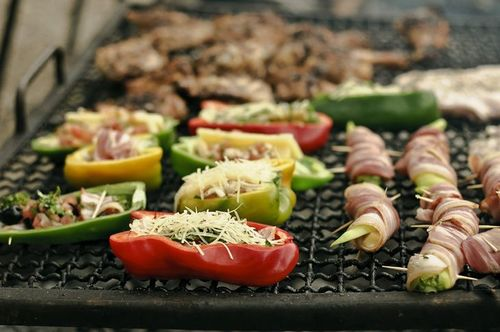

# La Parrilla de Rosendo

Nuestro amigo Rosendo inauguró su parrilla y nos pidió un sistema para administrar los platos que ofrece, sus comensales y sacar algunas estadísticas.

¡Comencemos! :yum:

## 1. Platos
Nos piden modelar los distintos platos que ofrece la parrilla. De cada uno de ellos nos interesa conocer:
* su **peso**, medido en gramos;
* si es **apto vegetariano**;
* su **valoración**, un número que indica qué tan bueno es el plato;
* si **es abundante**, lo cual es cierto cuando su peso es mayor a 250 gramos.

Consideraremos inicialmente estos platos:

### Provoleta
Cada provoleta tiene un peso diferente. Se debe informar además si **tiene especias** y si **es completa** (o sea, con jamón y morrones). La provoleta común es _apta vegetariano_, mientras que la completa no. 

Su _valoración_ es de 120 puntos si es especial, y de 85 en caso contrario. Decimos que una provoleta es especial cuando se cumple alguna de estas condiciones:
* _es abundante_ y _tiene especias_;
* o _es completa_. 

### Hamburguesas de carne
Su _peso_ es siempre de 250 gramos y lógicamente no son _aptas para vegetariano_. 
A cada hamburguesa se le configura su pan, y la _valoración_ se calcula como `60 + valoración del pan`. Los panes posibles son:
* **industrial** otorga 0 puntos;
* **casero** otorga 20 puntos;
* **de masa madre** otorga 45 puntos.

### Hamburguesas vegetarianas
Se comportan igual que las hamburguesas de carne, con tres diferencias:
* son _aptas para vegetariano_;
* para cada hamburguesa, se informa de qué legumbre está hecha (por ejemplo: `"lentejas"` o `"garbanzos"`);
* a la valoración se le suma otro plus, que se calcula como `2 * cantidad de letras del nombre de la legumbre`. Por ejemplo, si es de lentejas (que tiene 8 letras) el plus será de 16. 

Conviene chusmear la [Wollok Doc](https://www.wollok.org/documentacion/wollokdoc/), los _strings_ comparten varios métodos con las colecciones. :wink:

### Parrillada
Para cada parrillada se indica los cortes de carne pedidos. De cada corte se conoce su _calidad_ (un número) y su _peso_.

El _peso_ de la parrillada es la suma de los pesos de sus cortes. No es _apto vegetariano_. La _valoración_ se calcula como `15 * máxima calidad de sus cortes - cantidad de cortes`, y no puede dar un resultado negativo.

Ayudín: crear una clase para modelar los cortes y hacer que la parillada tenga una lista de cortes.

## 2. Comensales
Ya tenemos los platos, ahora nos faltan los comensales. :fork_and_knife:

De cada comensal nos interesa saber: 
* su **peso**, medido en gramos;
* si **le agrada un plato**, lo cual dependerá de su gusto culinario;
* los **platos que comió**, una lista de todo lo que haya ingerido. Implementar un método `comer(unPlato)` que lo agregue a la lista;
* y si está **satisfecho**, lo cual explicaremos a continuación.

Para que un comensal esté satisfecho, se tiene que cumplir que el peso de los platos ingeridos sea mayor o igual al 1% de su propio peso _y además_ una condición que define cada comensal (para que quede claro: se tienen que cumplir _ambas_ condiciones).

Consideraremos los siguientes tipos de comensales:

### Vegetarianos
Les agradan los platos que son apto vegetariano y tienen una valoración mayor o igual a 85. La condición adicional para estar satisfechos es que ninguno de los platos ingeridos sea abundante.

### Hambre popular
Simplemente les agradan los platos abundantes. No tienen ninguna condición adicional para estar satisfechos.

### De paladar fino
Les agradan los platos que pesan entre 150 y 300 gramos, y además tienen una valoración mayor a 100. La condición adicional para satisfacerse es que la cantidad de platos ingeridos sea par. 

## 3. Cocina
Agregar al modelo la cocina, que tiene _todos los platos_ que la parrilla tiene preparados. 

Se quiere poder consultar:
* si **tiene buena oferta vegetariana**: esto es así si la diferencia entre platos vegetarianos y no vegetarianos es de a lo sumo 2. Por ejemplo: si hay 10 carnívoros y 8 vegetarianos sí tiene buena oferta, pero si hay 11 carnívoros no (porque la diferencia es mayor a 2).
* **el plato fuerte carnívoro**: el de mejor valoración entre los no apto vegetariano;
* dado un comensal, la lista de **platos que le gustan**.

También se pide poder **servir un plato** para un comensal - cualquier plato que le guste de los que hay en la cocina. Si no le gusta ningún plato, lanzar un error. Si el plato existe, sacarlo de la cocina y hacer que el comensal lo coma.

**Ojo :eyes::** este método debe modificar al comensal y a la cocina. Para los tests, puede convenir crear un método auxiliar que solo devuelva el plato elegido y luego usar este método en el principal.

## 4. Criterios de selección de comida
Extender el sistema por el cual un comensal elige una comida de la cocina. Sigue manteniendose que debe ser una comida que le guste, pero en vez de elegir cualquiera se utilizan los siguientes criterios:

* Los **vegetarianos** eligen, entre las que les gustan, la primera que no sea abundante.
* Los **hambrientos populares** eligen, entre las que les gustan, la más pesada.
* Los **de paladar fino** eligen, entre las que les gustan, la que más se parezca a la ultima que comieron. Para simplificar, solo consideraremos si es vegetariana o no: si la ultima fue vegetariana, entonces eligen una vegetariana y viceversa. Si es la primera vez que van a la parrilla, eligen cualquiera.

Conviene primero hacer un método en el comensal que reciba una lista de platos que le gustan y devuelva el plato elegido, y luego utilizar ese método en la cocina.

## 5. Estadísticas

Agregar a la cocina los métodos para calcular las siguientes estadísticas:

### Polos opuestos

Dados dos comensales, verificar si son **polos opuestos**, lo cual es cierto si no hay ninguna comida que les guste a ambos.

### Almuerzo grupal

Dado un grupo de comensales (una lista), verificar si **pueden comer** en la parilla. Para esto, tener en cuenta que todos los comensales comerán al mismo tiempo y, por lo tanto, los platos tendrían que alcanzar para todos. 

A modo de ejemplo: si en el grupo hay tres vegetarianos y en la cocina solo hay dos platos apto vegetariano, ese grupo no puede comer en la parrilla. No alcanza con chequear que haya algún plato que le guste a cada uno, hay que pensar un algoritmo que sirva para todo el conjunto de comensales.

